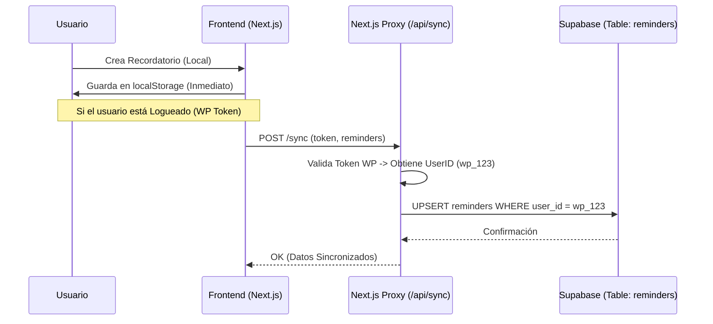

# Documentación Técnica Integral: PharmaPlus Headless E-commerce

Este documento detalla la arquitectura, funcionalidad y flujos críticos de la plataforma e-commerce *Headless* de PharmaPlus.

---

## 1. Header y Sistema de Menús 🧭

El componente `Header.tsx` actúa como el centro de navegación principal, adaptándose dinámicamente entre escritorio y móvil.

### Estructura Jerárquica
1.  **Top Bar (Desktop):** Información de confianza (Envíos, Línea de atención).
2.  **Main Bar:**
    *   **Logo:** SVG optimizado.
    *   **Live Search (`LiveSearch.tsx`):** Búsqueda en tiempo real con *debounce*.
    *   **Acciones Rápidas:**
        *   **Cotizar Envío:** Abre `ShippingModal`.
        *   **Blog Saludable:** Navegación interna a `/blog`.
        *   **Mi Cuenta / Carrito:** Gestión de sesión y compra.
3.  **Mega Menú de Categorías (Desktop):**
    *   Desplegable activado por *hover*.
    *   Consume `categories` (Tree Structure) desde WooCommerce.

### Comportamiento Responsive
*   **Desktop (`> 1024px`):** Menú horizontal completo.
*   **Mobile (`< 1024px`):**
    *   Header simplificado (Logo + Carrito + Menú Hamburguesa).
    *   **SideMenu (Sheet):** Se despliega lateralmente. Incluye acordeones para subcategorías y accesos directos (Blog, Rastreo).
    *   **BottomNav (`BottomNav.tsx`):** Barra fija inferior estilo "App Nativa" con accesos a Home, Categorías, Favoritos y Cuenta.

---

## 2. Gestión de Productos 📦

La data de productos es "sincronizada" en tiempo real o bajo demanda desde WooCommerce.

### Estructura y Taxonomía
*   **Fuente de Verdad:** WooCommerce (WordPress).
*   **Fetching:** `lib/woocommerce.ts` maneja las peticiones REST API.
*   **Cache:** Next.js `unstable_cache` con etiquetas (`revalidate: 600` o `3600`) para performance.

### ❄️ Productos Refrigerados (Cadena de Frío)
Sistema crítico para asegurar la integridad de medicamentos sensibles.

*   **Detección (`lib/coldChain.ts`):**
    1.  **Metadatos:** Busca `meta_data` key `_cadena_de_frio` === 'yes'.
    2.  **Categoría:** Si el producto pertenece a la categoría "Cadena de Frío".
    3.  **Heurística:** Analiza título/descripción buscando keywords: "Insulina", "Refrigerado", "Vacuna".
*   **UI/UX:**
    *   **Badge:** Etiqueta azul hielo sobre la imagen del producto.
    *   **Alertas:** Mensaje destacado en PDP (`ProductDetails`) y QuickView.

---

## 3. Módulo de Pastillero Virtual 💊

Sistema de adherencia al tratamiento centrado en la privacidad y sincronización transparente.

### Arquitectura "Silent Sync"
Permite sincronizar recordatorios sin obligar al usuario a crear una cuenta nueva compleja.



### Integración Perfil Médico
*   Los datos médicos sensibles (alergias, diagnósticos) se manejan con **RLS (Row Level Security)** en Supabase, accesibles solo mediante el token validado del usuario.

---

## 4. Sistema de Financiamiento 💰

Accesible vía `/app/financiamiento`, ofrece múltiples pasarelas según el perfil del usuario.

### Estructura de Rutas
*   `/app/financiamiento/bancolombia`: Integración o formulario de lead para crédito bancario.
*   `/app/financiamiento/credito-libre`: Solución propia o de terceros.
*   `/app/financiamiento/wompi`: Financiación directa en pasarela.

### Flujo de Aprobación (General)
1.  **Solicitud:** Usuario llena formulario "Wizard" (Paso a paso).
2.  **Pre-validación:** Frontend valida reglas de negocio básicas (Edad, Monto).
3.  **Procesamiento:** Datos enviados a API externa/CRM.
4.  **Respuesta:** Feedbak inmediato (Aprobado/Rechazado/En revisión).

---

## 5. Conexiones Externas 🔌

### Supabase (Backend Serverless)
Utilizado para funcionalidades "App-like" de alta interactividad.
*   **Tablas Clave:**
    *   `reminders`: Pastillero.
    *   `profiles`: Datos extendidos de usuario (vinculados por `wp_id`).
    *   `wishlist`: Lista de deseos sincronizada.
*   **Seguridad:** Accesos mediados por `SERVICE_ROLE` en el servidor (API Routes) o RLS en cliente.

### WooCommerce (Backend E-commerce)
Fuente de verdad para catálogo y órdenes.
*   **Productos:** Read-Only API.
*   **Órdenes:** Write API (Creación de pedidos).
*   **Clientes:** Read/Write (Auth JWT).
*   **Sincronización:** No hay base de datos local de productos. Next.js actúa como "cabeza" (Head) visualizando la data de WP.

---

## 6. Sistema de Usuarios 👤

Modelo híbrido para mantener compatibilidad con el ecosistema WordPress existente.

*   **Registro:** Se crea el usuario en WordPress (`wp_users`).
*   **Autenticación:**
    *   Login vía JWT (JSON Web Token) contra WP REST API.
    *   El token se almacena en cookies seguras (`httpOnly`) o memoria cliente.
*   **Vinculación:**
    *   El ID de WordPress (ej. `1540`) es la "Llave Maestra".
    *   En Supabase, los registros usan este ID en un campo texto `user_id` para relacionar datos sin duplicar autenticación.

---

## 7. Proceso de Checkout y Envíos 🛒

Flujo optimizado en una sola página (One Page Checkout) o pasos simplificados.

### Calculadora de Envíos Dinámica (`ShippingCalculator.tsx`)
1.  **Input:** Usuario selecciona Departamento/Ciudad.
2.  **Consulta:** `lib/shipping.ts` consulta `/wc/v3/shipping/zones` en WP.
3.  **Matching:**
    *   Busca si la ciudad está en una zona específica (ej: Bogotá).
    *   Si no, aplica tarifa "Resto del país".
4.  **Resultado:** Actualiza el total del carrito antes del pago.

### Pasarelas
*   **Integración:** Wompi (Bancolombia) y opciones nativas de WooCommerce.
*   **Webhook:** WooCommerce recibe la confirmación de pago y actualiza el estado del pedido a "Procesando".

---

## 8. Gestión de Contenidos (Blog) 📰

Sistema Headless implementado en `/app/blog`.

*   **CMS:** WordPress (Entradas estándar).
*   **Frontend:**
    *   Consume `/wp-json/wp/v2/posts`.
    *   Renderiza contenido HTML seguro con `@tailwindcss/typography`.
*   **SEO:** Generación dinámica de `metadata` (Título, Descripción, OpenGraph) basada en el post.

---

## 9. Detalles Técnicos Adicionales 🛠️

### Stack Tecnológico
*   **Framework:** Next.js 14+ (App Router).
*   **Estilos:** Tailwind CSS v4 (Glassmorphism, Animaciones).
*   **Estado Global:** React Context (`CartContext`, `QuickViewContext`).
*   **Iconos:** Lucide React & Solar Icons.

### Seguridad y Cookies
*   **Variables de Entorno:**
    *   `NEXT_PUBLIC_...`: Solo para configuraciones públicas (URLs).
    *   `WOOCOMMERCE_..._SECRET`: **NUNCA** expuestas al cliente. Usadas solo en Server Components o API Routes.
*   **Gestión de Privacidad GDPR:**
    *   Sistema de consentimiento granular (`useCookieConsent`).
    *   Geolocalización protegida (Solo con permiso explícito).

### Diagrama de Arquitectura de Datos

```mermaid
graph TD
    User[Usuario Cliente]
    Next[Next.js Frontend]
    WP[WordPress / WooCommerce]
    Supa[Supabase]

    User -->|Navega/Compra| Next
    Next -->|Lee Productos (ISR)| WP
    Next -->|Crea Orden| WP
    Next -->|Auth (JWT)| WP
    
    Next -->|Sync Pastillero| Supa
    Next -->|Sync Wishlist| Supa
    
    WP -->|Webhook Orden| Logistica[Sistema Logístico]
```
